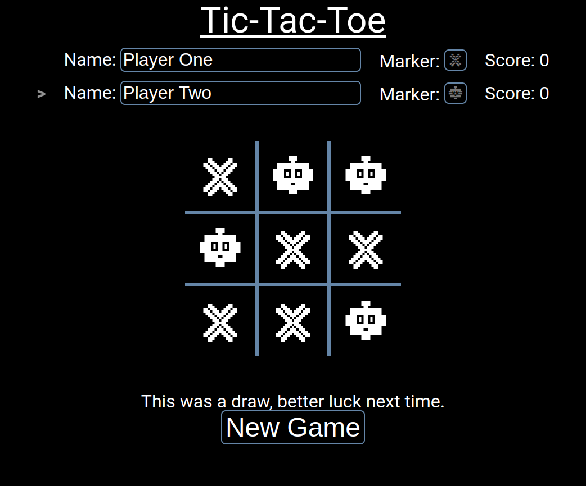

# Tic-Tac-Toe



## Summary

**Hosted:** [Tic-Tac-Toe](https://blurryq.github.io/tic-tac-toe/)

This is a classic two-player Tic-Tac-Toe game, where players can enter their names, pick their markers by typing letters, and start playing on a responsive, real-time grid. The game UI updates automatically to show which player’s turn it is, track scores, and announce winners.

## Features

- **Dynamic Player Setup**: Players choose their names and markers to start the game.

- **Real-Time Updates**: Turn indicators, scores, and game results refresh instantly.

- **Input Validation**: Ensures players have unique names before they can start.

- **Keyboard Accessibility**: Fully playable with a keyboard for an inclusive experience.

- **Lightweight Design**: Built with only HTML, CSS, and JavaScript for quick, responsive play.

## Setup

To get started with this project, follow the steps below:

### 1. Fork the Repository

First, you need to fork this repository to your GitHub account by clicking the "Fork" button near the top right of this page. If you are unfamiliar with this process, please follow this GitHub [guide](https://docs.github.com/en/pull-requests/collaborating-with-pull-requests/working-with-forks/fork-a-repo).

### 2. Clone the Repository

Next, clone the repository to your local machine using the following command. Make sure to replace `your-username` with your GitHub username:

```
git clone https://github.com/your-username/tic-tac-toe
```

### 3. Running the File

Once cloned, navigate to your project folder, locate the HTML file, and double-click it. This should open the file in your default browser.

Alternatively, if you're using Visual Studio Code, you can install the "Live Server" extension and use it to launch the project by right-clicking on the HTML file and selecting **Open with Live Server**.

### 4. Have Fun

Dive in, play, and feel free to explore and modify the code to make it your own... just make sure to have fun! :)

## Challenges and Skills Demonstrated

Building this project expanded my skills in JavaScript, specifically using an Immediately Invoked Function Expression (IIFE) to organize the codebase in a modular way, making it easy to maintain and extend. The game relies solely on HTML, CSS, and JavaScript, showing core skills in DOM manipulation and interactive UI handling.

### Challenges Faced:

- **State Management**: Ensuring that the game’s state stayed in sync with the UI (like whose turn it is and when someone wins) was a significant challenge, especially given the asynchronous nature of user actions.

- **Validation & User Experience**: Adding validation for player names and creating responsive error messages helped streamline the player experience.

- **Keyboard Accessibility**:  Enabling keyboard-based gameplay required careful thought, especially around handling focus states for the grid.
